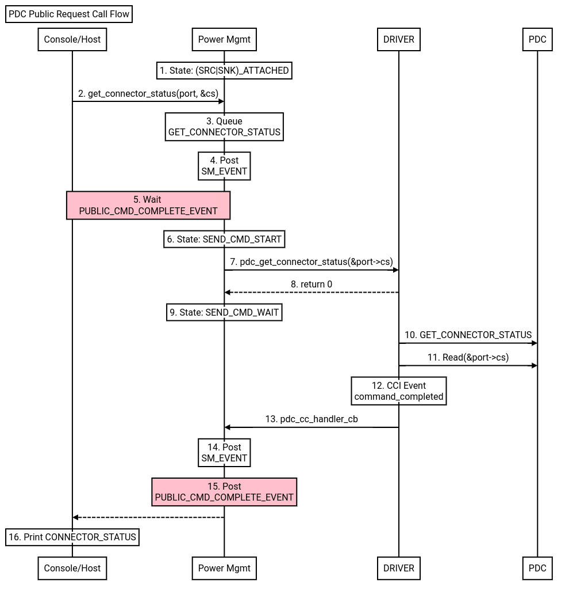

# Zephyr EC PDC Architecture

[TOC]

## Overview
TODO(b/384517822) - Document EC PDC Architecture

## PDC Console Commands
See [zephyr/subsys/pd_controller/pdc_console.c](https://chromium.googlesource.com/chromiumos/platform/ec/+/main/zephyr/subsys/pd_controller/pdc_console.c)

## PDC Driver API
See [zephyr/include/drivers/pdc.h](https://chromium.googlesource.com/chromiumos/platform/ec/+/main/zephyr/include/drivers/pdc.h)

### Supported drivers
See [zephyr/drivers/usbc/](https://chromium.googlesource.com/chromiumos/platform/ec/+/main/zephyr/drivers/usbc/)

## Power Management
[zephyr/subsys/pd_controller/pdc_power_mgmt.c](https://chromium.googlesource.com/chromiumos/platform/ec/+/main/zephyr/subsys/pd_controller/pdc_power_mgmt.c)

### State Machine Diagram

## Call Flows

### PDC Attach Sequence
A generic call flow for when a device is plugged into PDC port to illustrate
the communication between PDC, DRIVER, and Power Management modules.

*Note: Between step 9 and 13, the connector status is NOT valid yet, as the driver
 has not populated the structure until step 13.  Power Mgmt is not informed of this
 until step 15.*

### PDC Public Request
A generic call flow for when console or host requests are made to PDC Power Management.

*Note: Public requests are handled after policies have been applied and completed!*

### PDC Dead Battery Handling
Upon initialization in dead battery scenarios, the PDC only negotiates 5V. This
protects the system from reverse current appearing on Type-C chargers when two
or more chargers are connected.  When EC selects the "best" charger in dead
battery scenarios, EC needs to disable sink paths on the non-preferred chargers
first to prevent reverse current before requesting more power from the "best" charger.
This is illustrated in the call flow below.

Dead battery scenarios the EC handles

 Num PDC ports sinking | Battery status | Expectation
 :--------------------:| :------------: | :----------
 `1`                   |  Present       | Select the best PDO available from charger.  Depending on battery level, the AP may boot before or after picking best PDO (see [low battery startup](../low_battery_startup.md) for details on AP boot conditions).
 `1`                   |  Not present   | The end result is effectively the same as the first case, because the charge manager will prevent AP from booting with the 5V PDO. This allows PDC subsystem to still select the best PDO and then we can boot the AP. The AP will boot after the best PDO selected.
 `> 1`                 |  Present       | First, charging is disabled on all but 1 port. Then the PDC subsys selects the best PDO for the selected port.  The AP is permitted to boot immediately, while the best PDO logic runs.
 `> 1`                 |  Not present   | Similar to previous case, but AP boot is delayed.
